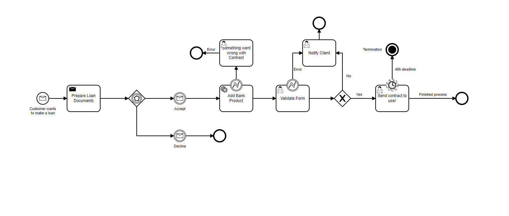
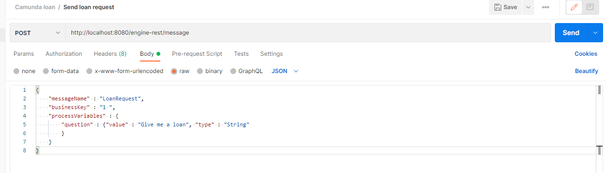
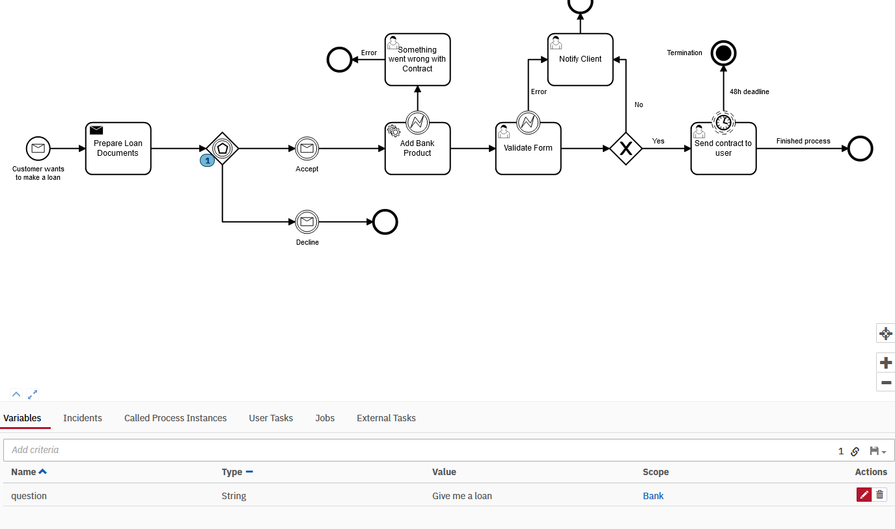

#Assignment 4 - Software Integreation
## Business Process Modelling and Automation using camunda
A bank has automated the business process of giving loans to private clients.

###Camunda model:

This project runs the process.bpmn on localhost:8080.
When the process is running the user recives multiple forms to request a loan.
Depending on how the process is going the user will recive an error or a new form page.

If the users income is less than 1000 Dollars, the user is declined for a loan.
When requesting a loan the user gets a loan procentage and an amount. If the loan requestet is above 123456789 the code will throw an error and the user will see this error

In camunda, we start the process by sending a loan request. 
This is started by the starting node Message Intermediate Cach Event, which activates the "Prepare Loan Documents".
After this is done, it stops at the Event Gateway to see if the customer is edible for a loan at the bank,

The request is started in postman as seen below. We send the request in a JSON format through a POST request to http://localhost:8080/engine-rest/message
here we specify the MessageName, BusinessKey and a question about a loan.

When the Post message is sent, the process is started, an we can see that we are now at the Event Gateway, waiting to accept or decline the request from the customer.

