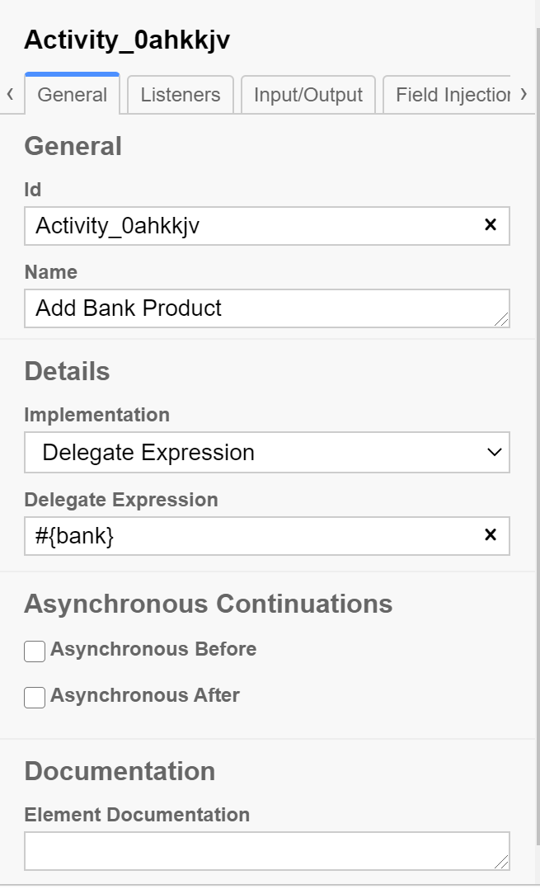
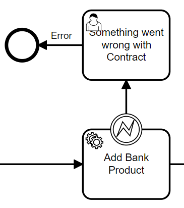

#Assignment 4 - Software Integreation
## Business Process Modelling and Automation using camunda
A bank has automated the business process of giving loans to private clients.

###Camunda model:

This project runs the process.bpmn on localhost:8080.
When the process is running the user receives multiple forms to request a loan.
Depending on the users income, the project will check an income variable and if income < 1000 the user will recive an error otherwise a new form page.

The camunda process "Add bank product" is a service task that communicates with a java Bank class.\

this is done using a delegate expression referring to the java class.

The java Bank class makes a check on the users income and creates a loan offer with an interest rate, and a loan amount.
If the loan requestet is above 123456789 the code will throw an error, and the user is send to "Something went wrong with the contract" and will see this error in the flow.

In camunda, we start the process by sending a loan request. 
This is started by the starting node Message Intermediate Cach Event, which activates the "Prepare Loan Documents".
After this is done, it stops at the Event Gateway to see if the customer is edible for a loan at the bank,

The request is started in postman as seen below. We send the request in a JSON format through a POST request to http://localhost:8080/engine-rest/message
here we specify the MessageName, BusinessKey and a question about a loan.

When the Post message is sent, the process is started, and we can see that we are now at the Event Gateway, waiting to accept or decline the request from the customer.

